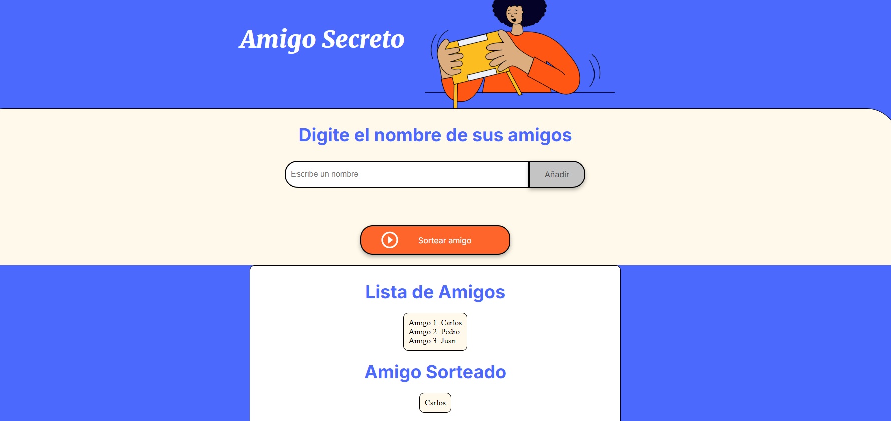

# Amigo Secreto

Este es un proyecto web para organizar un juego de "Amigo Secreto". Permite a los usuarios agregar nombres de amigos y sortear aleatoriamente un amigo secreto.

## Tecnologías Utilizadas

- HTML
- CSS
- JavaScript

## Estructura del Proyecto

- `index.html`: Contiene la estructura principal de la página web.
- `style.css`: Contiene los estilos para la página web.
- `app.js`: Contiene la lógica para agregar amigos y sortear el amigo secreto.

## Cómo Usar

1. Clona el repositorio en tu máquina local.
2. Abre el archivo `index.html` en tu navegador.
3. Ingresa los nombres de tus amigos en el campo de texto y haz clic en "Añadir".
4. Una vez que hayas agregado todos los nombres, haz clic en "Sortear amigo" para seleccionar aleatoriamente un amigo secreto.

## Funciones Principales

- **Agregar Amigo**: Permite agregar nombres a la lista de amigos.
- **Sortear Amigo**: Selecciona aleatoriamente un nombre de la lista de amigos.

## Capturas de Pantalla

## Contribuciones

Las contribuciones son bienvenidas. Por favor, abre un issue o envía un pull request para mejorar el proyecto.

## Licencia

Este proyecto está bajo la Licencia MIT.

